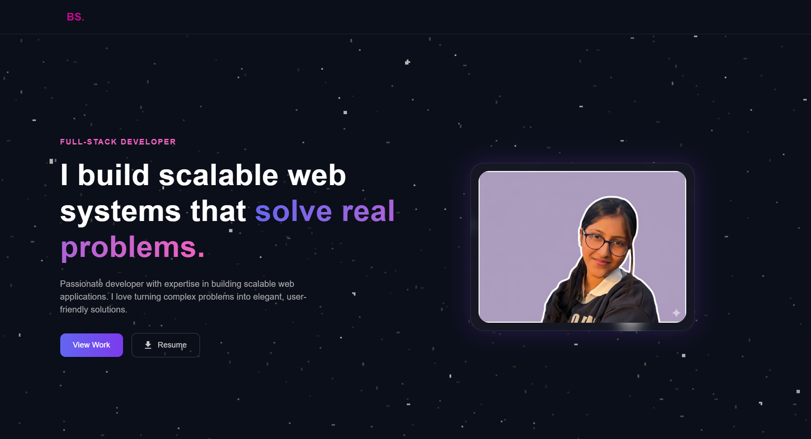

# 🌐 Bhumi Saraogi – Portfolio

Welcome to my personal portfolio repository!  
I’m a **Computer Science Engineering student** passionate about building clean, scalable, and user focused web applications using the **MERN Stack**.

This portfolio showcases my projects, skills, and experience, designed with a modern dark UI and smooth user experience.

---

## 🚀 Live Website

🔗 **Live Portfolio:**  
https://portfolio-5logcuw2r-bhumis-projects-51b1c17d.vercel.app/

## 📸 Preview

---

## 🛠 Tech Stack

- **Frontend:** React.js
- **Styling:** CSS3, Bootstrap, Material UI
- **Animations:** CSS Transitions
- **Email Service:** EmailJS
- **Deployment:** Vercel
- **Version Control:** Git & GitHub

---

## ✨ Features

- Dark-themed modern UI
- Fully responsive design
- Smooth scrolling navigation
- Dynamic project section with case studies
- Functional contact form (EmailJS integration)
- Resume download functionality
- Optimized performance using Vite
